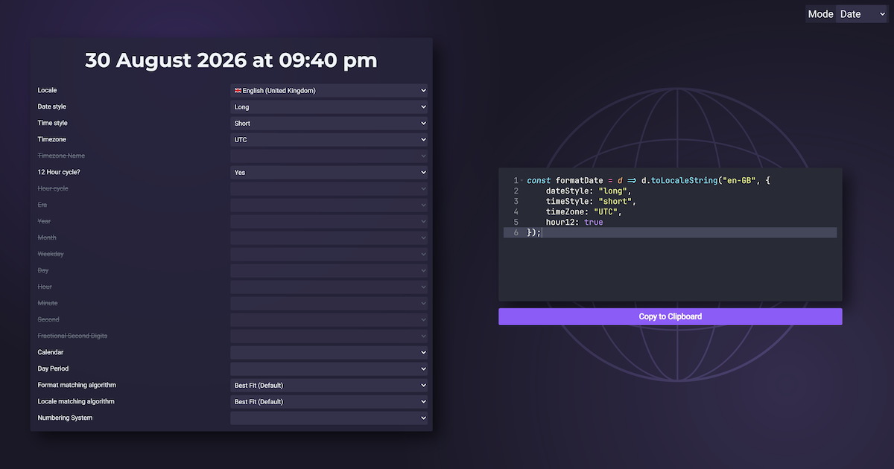

# `toLocaleString` Generator
Automatically generate JavaScript code to format `Date` and `number` values using the `Intl` APIs. Allows selecting locale and formatting options using dropdowns, validates that the combination is valid, and shows a preview of the result.

## **[Try it online!](https://lebster.xyz/projects/localestring)**

